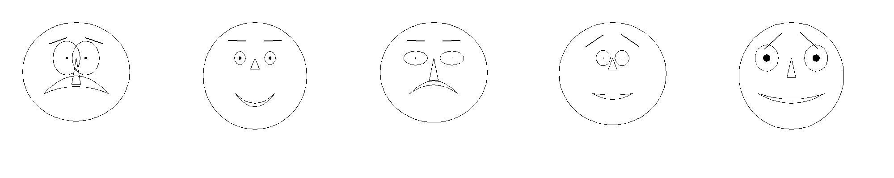
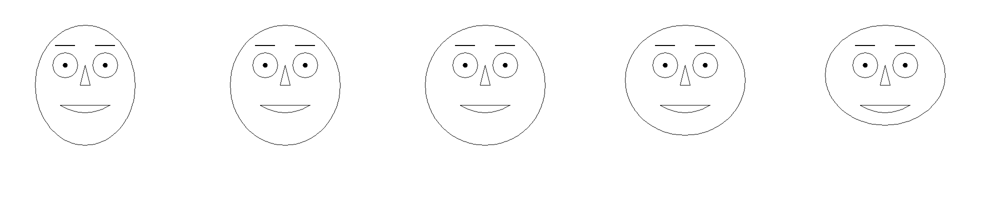
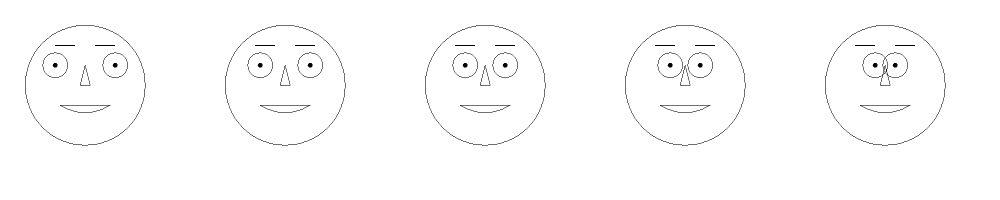

#Chernoff Faces

This is library to produce Chernoff Faces to display data. A face has ten 
attributes that are used to show variation in values. 

This show the range from min to max on all of the values:

### Head Shape 
The more eccentric in the x axis it is the larger the value. Likewise larger values, 
 the more eccentric in the y axis for smaller values.

### Eye Shape 
Eccentricity as with head shape.

### Pupil Size

### Eye Brow Tilt 
Lower on the outside smaller values, higher on the inside larger.

### Nose Size

### Mouth Height 
More frowny smaller, more smiley larger.

### Eye Spacing 
The distance between eyes.

### Eye Size

### Mouth Width

### Mouth Openess

